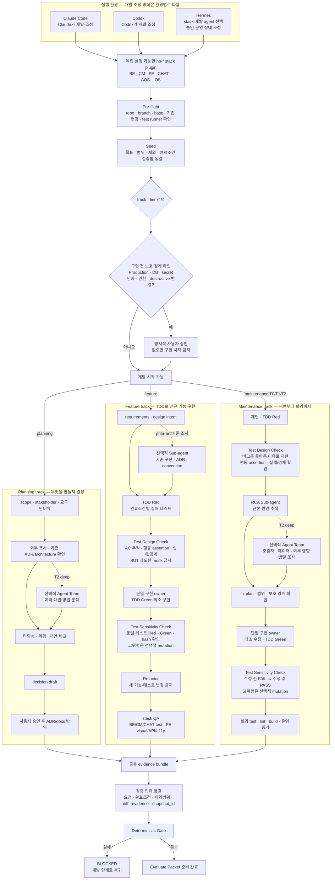
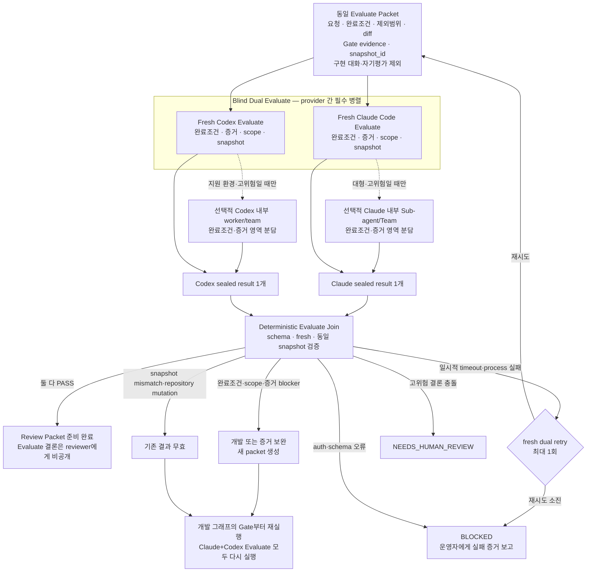
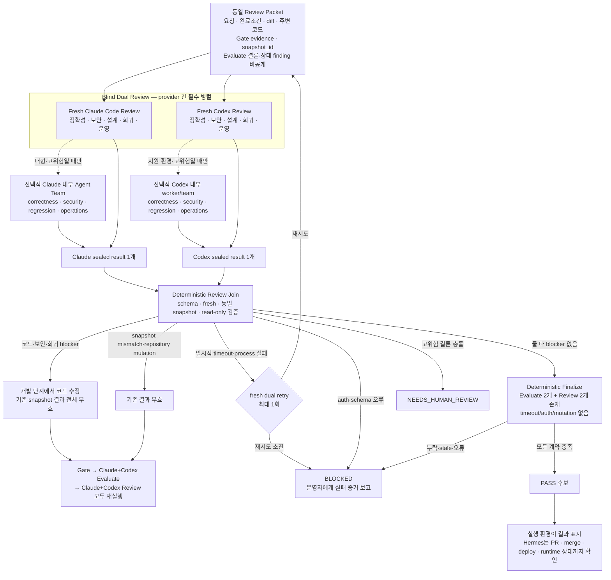

# BUCCL Dev Harness

BUCCL의 여섯 레포(메인 BE / 커뮤니티 CM / 프론트엔드 FE / 채팅 CHAT / 모바일 웹뷰 앱 AOS·iOS)를 위한 Claude Code 기반 개발 자동화 파이프라인.
하나의 마켓플레이스에 **일곱 플러그인**이 들어 있다 — 레포별 6개와 공통 방법론 코어 `hb-shared`.

## 일곱 플러그인

| 플러그인 | 대상 레포 | 스택 | 슬래시 prefix |
|---------|----------|------|--------------|
| `hb-be` | `BE/` (메인 백엔드) | Django 5.2 + DRF + MySQL + Celery + Redis + Azure Blob | `/hb-be:...` |
| `hb-cm` | `CM/` (커뮤니티) | Node 18 + TS 5.3 + Express + MySQL + Redis + Socket.io + Jest | `/hb-cm:...` |
| `hb-fe` | `FE/` (프론트엔드) | React 18 + CRA + React Router + Zustand + MUI/Bootstrap + Capacitor | `/hb-fe:...` |
| `hb-chat` | `CHAT/` (채팅 MSA) | Node 18 + TS + Express + Socket.io + MySQL + Redis + Azure Blob + Jest | `/hb-chat:...` |
| `hb-aos` | `AOS/` (Android 웹뷰 앱) | Kotlin + Gradle KTS + WebView + FCM + JUnit | `/hb-aos:...` |
| `hb-ios` | `IOS/` (iOS 웹뷰 앱) | Swift + Xcode + WKWebView + FCM + XCTest | `/hb-ios:...` |
| `hb-shared` | (공통) | 스택 무관 방법론 코어 — 6개 플러그인이 공유 | `/hb-shared:...` |

`hb-be`/`hb-cm`/`hb-fe`는 **3-track 구조**(기획/신규개발/유지보수)를 공유한다.
`hb-chat`은 여기에 chat 특성상 **ADR 트랙·Contract 트랙·dual review gate**를 더한다 (계약이 깨지면 FE/BE/앱이 동시에 깨지므로). 스택별로 명령(테스트 명령, 레이어 용어, 컨벤션 ID)이 다르다.
`hb-aos`/`hb-ios`는 FE 웹을 싣는 **모바일 웹뷰 쌍둥이**다 — 3-track에 **두 모드(shell 기능 / 브리지 계약)**와 **패리티 장치**(전 트랙 완전 미러 + 형제 플랫폼 반영 기록, 설계는 `docs/MOBILE-SHELL-DESIGN.md`)를 더한다.
`hb-shared`는 6팀 공통 **방법론 순서표**(seed → evaluate → review → evolve)와 공통 보조 명령을 제공한다 (아래 "일하는 순서").

## 운영 모드 — 명시 호출 (opt-in)

이 하네스는 **명시 호출 방식**으로 운용한다. 제품 레포(BE/FE/Community/모바일 AOS·iOS)의 CLAUDE.md·AGENTS.md에는 하네스를 자동 연결하지 않는다 — 2026-06-26에 하네스 기계장치를 의도적으로 제거하고 지식(컨벤션·경계 규칙)만 남겼다. 필요할 때 해당 레포에서 `/hb-*` 트랙 명령을 직접 호출한다. 예외로 **chat 레포만** always-read 연결(CLAUDE.md 규약)을 유지한다.

## 일하는 순서 (hb-shared 공통 방법론)

| 단계 | 명령 | 하는 일 |
|------|------|--------|
| ② seed | `/hb-shared:seed` | 주문서 — 목표·범위·제외·완료기준·검증법 한 장 (크기별 약식~전체, 빈틈 점검 내장) |
| ④ 검사(Evaluate) | `/hb-shared:evaluate` | 동일 packet을 blind fresh Claude+Codex가 독립 검사 — AC·증거·scope·운영 완료 판정 |
| ⑤ 평가(Review) | `/hb-shared:review` | Dual Evaluate 통과 후 동일 packet을 blind fresh Claude+Codex가 구현·보안·회귀·테스트 품질 평가 |
| ⑥ evolve | `/hb-shared:evolve` | 반복 문제 → 개선 제안 (제안만, 자동 수정 X) |

- ①interview는 필요 시, ③build는 각 도메인 플러그인(feature/maintenance)이 담당한다.
- **완료기준·증거·리뷰 렌즈는 각 스택을 따른다.** FE는 **디자인 구현 / API 바인딩**, AOS/IOS는 **shell 기능 / 브리지 계약** 두 모드로 나뉘어 기준이 다르다.
- 무거운 읽기·검증은 Sub-agent로 내려 메인 컨텍스트를 아끼고 결론·경로만 회수한다. 울트라코드(워크플로우)가 켜지면 병렬+반박으로 더 정밀해지고, 꺼져도 가볍게 작동한다.
- 공통 보조 명령: `requirements`·`criteria`·`design-intent`·`prior-art`(feature), `convention-check`(maintenance), `feasibility`(planning) 가 `hb-shared`로 모여 있다. `requirements`·`criteria`는 seed에 **흡수**되어 기본 흐름에서는 seed가 대신하고, 나머지는 파이프라인 밖에서 그 단계만 따로 돌릴 때 쓰는 opt-in 명령이다.

## 개발·검사(Evaluate)·평가(Review) 목표 흐름

> **상태: 보안 경계 후보 구현·고장 주입 완료, Shadow 및 설치 전.** 아래 세 그래프는 기존 제품·stack 개발 절차와 운영 안전 경계를 유지하면서 Evaluate와 Review를 fresh·same-snapshot·blind dual-provider 관문으로 개선한 후보 구조다. model semantic result와 parent execution envelope를 분리하고, macOS source write 차단·packet tamper·standalone plugin 시험까지 통과했지만 설치된 operational path의 blocking gate로는 아직 승격하지 않았다.

### 전체 Dual workflow 실행

sealed packet과 단계별 prompt를 만든 뒤 canonical 또는 standalone 실행 파일로 시작한다.

```bash
SHARED/bin/hb-eval-review run \
  --packet .harness/artifacts/<track>/<id>/packet.json \
  --packet-source .harness/artifacts/<track>/<id>/packet \
  --evaluate-prompt .harness/artifacts/<track>/<id>/evaluate-prompt.md \
  --review-prompt .harness/artifacts/<track>/<id>/review-prompt.md \
  --output-root .harness/artifacts/<track>/<id>/eval-review \
  --claude-model claude-fable-5-1 \
  --codex-model gpt-5.6-sol \
  --timeout 480
```

standalone plugin에서는 `SHARED/bin/...` 대신 `BE/bin/...`, `CM/bin/...`, `FE/bin/...`, `CHAT/bin/...`, `AOS/bin/...`, `IOS/bin/...`를 사용한다. output 디렉토리는 비어 있어야 하며 packet source 밖에 둔다. 부모 runner가 Evaluate 두 결과를 확인한 뒤에만 Review를 시작하고 `final-result.json`을 저장한다.

#### 실행 전 보안 조건

- macOS runner는 `(deny default)` Seatbelt profile에서 provider를 실행한다. materialized packet은 읽기 전용이고, 현재 provider output만 쓰기 가능하다. 사용자 HOME, sibling output, SSH/GH/Keychain CLI는 접근할 수 없다.
- Claude는 사용자 Keychain/HOME을 재사용하지 않는다. `CLAUDE_CODE_OAUTH_TOKEN`, `ANTHROPIC_API_KEY`, `ANTHROPIC_AUTH_TOKEN` 중 하나를 process 환경에 최소 주입해야 하며 없으면 `CLAUDE_MINIMAL_AUTH_MISSING`으로 중단한다.
- Codex는 `HB_CODEX_AUTH_FILE`로 지정한 `auth.json` 한 파일만 provider별 임시 HOME에 복사한다. 생략 시 `$HOME/.codex/auth.json`을 parent가 복사하지만 provider에게 원래 HOME 경로는 열지 않는다.
- provider별 임시 HOME은 해당 stage가 끝나면 성공·실패·timeout과 관계없이 삭제한다.
- `packet.json`은 `request`, `evidence_entries`, 세 identity를 포함해야 한다. runner가 source bytes와 evidence hash를 다시 계산하고 prompt digest까지 일치할 때만 provider를 시작한다.
- oracle과 A/B mapping은 provider sandbox의 readable root 밖에 두고, raw 결과를 hash·봉인하기 전에는 provider prompt/source에 넣지 않는다.

### 1. 개발 — 안전하게 구현하고 테스트



- 개발은 planning·feature·maintenance로 나뉘며 각 track의 실제 산출물과 검증 단계를 거친다.
- 코드 구현은 하나의 owner가 최종 책임을 갖고, Sub-agent/Agent Team은 prior-art·대안·영향도처럼 독립 탐색이 가능한 작업에만 사용한다.
- Test Design Check는 Green 구현 전에 AC-테스트 추적성, 행동 중심 assertion, 실패·경계 조건, mock 범위를 점검한다. 실패하면 구현을 시작하지 않는다.
- Test Sensitivity Check는 동일 테스트의 Red→Green과 테스트 파일 hash를 확인한다. 인증·권한·결제·DB 무결성 등 고위험 변경은 격리 환경에서 선택적 mutation으로 테스트가 실제 결함을 잡는지 확인한다.
- 기존 개발 하네스의 제품 지식, stack별 TDD, 승인, Production 안전 경계는 유지한다.
- 개발 결과가 바뀌면 새로운 `snapshot_id`를 만들고 이후 검증을 처음부터 다시 시작한다.

### 2. 검사(Evaluate) — 주문대로 완료됐는지 확인



- Claude Code와 Codex Evaluate는 항상 fresh process/session에서 동시에 독립 실행한다.
- 두 evaluator는 상대 결과를 보기 전에 provider별 결과 하나를 봉인한다.
- Evaluate는 “주문대로 완성됐는가?”만 판정하며 버그·설계 전반 Review를 반복하지 않는다.
- 내용상 blocker이면 개발·증거를 보완한 뒤 Gate와 Claude+Codex Evaluate를 모두 다시 실행한다.
- 일시적 timeout·process 실패만 같은 packet으로 fresh dual retry를 최대 1회 허용한다.
- 인증·schema 오류는 즉시 `BLOCKED`하며 원인을 수정한 뒤 다시 실행한다. snapshot 불일치나 repository mutation은 Gate부터 재실행한다.

### 3. 평가(Review) — 구현과 테스트가 정확하고 안전한지 확인



- Claude Code와 Codex Review는 항상 같은 snapshot을 blind-first 방식으로 병렬 검토한다.
- provider 내부 Agent Team은 다중 모듈·인증·권한·DB·Production처럼 관점을 나눌 가치가 있을 때만 사용한다.
- 같은 provider의 여러 agent는 coverage를 넓히지만 Claude/Codex 독립 검증을 대체하지 않는다.
- 내용상 blocker를 수정하면 snapshot이 바뀌므로 Gate부터 Dual Evaluate와 Dual Review를 모두 다시 실행한다.
- 일시적 timeout·process 실패만 같은 Review Packet으로 fresh dual retry를 최대 1회 허용한다.
- 인증·schema 오류는 즉시 `BLOCKED`하며 원인을 수정한 뒤 다시 실행한다.
- reviewer는 repository read-only이며, reviewer mutation이나 예상하지 않은 snapshot 변화가 발견되면 즉시 `BLOCKED`다.

### 환경별 동일 관문

| 실행 환경 | 개발·조정 주체 | Evaluate | Review | 최종 역할 |
|---|---|---|---|---|
| Claude Code | Claude Code | Fresh Claude Code ∥ Fresh Codex | Fresh Claude Code ∥ Fresh Codex | 결과 통합·표시 |
| Codex | Codex | Fresh Codex ∥ Fresh Claude Code | Fresh Codex ∥ Fresh Claude Code | 결과 통합·표시 |
| Hermes | Hermes가 stack·개발 agent 선택 | Fresh Claude Code ∥ Fresh Codex | Fresh Claude Code ∥ Fresh Codex | 결과 조정 + PR·merge·deploy·runtime 확인 |

## 트랙 비교 (공통)

| 트랙 | 언제 쓰나 | 코드 수정 | 최종 출력 |
|------|----------|----------|---------|
| `planning` | 무엇을 만들지 확정 전 | 없음 (문서만) | ADR 드래프트 → adr.yaml 편입 |
| `maintenance` | 버그, 리팩토링, 성능 개선 | 있음 (범위 제한적) | 수정 커밋 + 회귀 리포트 |
| `feature` | 새 기능/서비스 추가 | 있음 (범위 큼) | PR + 리뷰 반영 완료 코드 |

## tier 체계 (공통)

각 트랙은 3개 tier로 운용된다. **기본값은 T1 `auto` — lightweight**.
full ceremony가 필요한 경우에만 명시적으로 `:deep`을 호출한다.

| tier | 이름 | 용도 | 사용자 핑퐁 | Agent Team |
|------|------|------|------------|------------|
| T0 | `hotfix` (maintenance 전용) | 오타, 한 줄 fix, 긴급 수정 | 최소 | 없음 |
| T1 | `auto` (기본값) | 일상 작업 | 중간 | 없음 |
| T2 | `deep` | 아키텍처급 결정, 복잡 기능, 심층 진단 | 많음 | 있음 (planning/maintenance만) |

- `auto` 산출물은 `deep` 산출물의 **부분집합**이다. 동일 트랙에서 tier 전환이 안전하다.
- `hotfix`는 독립 경로로, 다른 tier를 선행하지 않는다.
- 트랙 간 전이(planning↔feature↔maintenance)는 tier와 무관하게 동일하게 작동한다.

## 실행 모드 분포 (공통)

| 트랙 | Fork | Sub-agent | Agent Team |
|------|------|-----------|------------|
| 기획 | P1, P2, P5, P6 | P3 | P4 (대안 분석) |
| 유지보수 | M2, M6, M7, M7.5 | M3, M5, M9 | M4 (영향도), M8 (회귀) |
| 신규개발 | F2, F4, F6~F9, F11 | F3, F5, F10 | — |

(BE deep 기준. M9는 Sub-agent+Fork 혼합. FE/CHAT feature는 검증·계약 스텝이 추가되어 번호가 밀린다 — FE는 F12까지.)

## 트랙 간 전이 (각 플러그인 안에서)

```
기획 → /<plugin>:shared:update-docs adr (승인 게이트) → 신규개발 → 유지보수
                                                    ↑                |
                                                    └── 에스컬레이션 ←┘
```

## 산출물 구조 (공통)

```
.harness/artifacts/
  planning/{plan-YYYYMMDD-slug}/
    scope.md, stakeholders.md, requirements-interview.md,
    external-research.md, alternatives.md, feasibility.md,
    decision-draft.md, INDEX.md
  maintenance/{issue-id}/
    reproduction.md, root-cause.md, impact-analysis.md,
    convention-check.md, fix-plan.md, regression-report.md,
    review-comments.md, INDEX.md
  feature/{branch-name}/
    requirements.md, prior-art.md, design-intent.md,
    code-quality-guide.md, pr-body.md, review-comments.md, INDEX.md

  각 트랙 공통(해당 시): seed.md,
    tdd-baseline-log.txt, tdd-green-log.txt, tdd-refactor-notes.md
```

FE feature/maintenance는 필요 시 design-source.md, visual-check.md,
responsive-check.md, accessibility-notes.md, api-binding-check.md,
visual-regression.md를 추가로 남긴다.
AOS/IOS feature/maintenance는 필요 시 device-check.md, permission-check.md,
release-check.md, bridge-check.md, parity-proposal.md(형제 플랫폼 반영 제안)를 추가로 남긴다.

## Repository 주제별 진실의 원천과 `.harness/docs/`

하네스가 모든 사실의 우선순위를 임의로 정하지 않는다. 먼저 repository의 `AGENTS.md` / `CLAUDE.md` / `.harness/README.md`가 **어떤 주제의 진실의 원천이 어디인지** 선언했는지 확인한다.

1. 코딩 규칙·ADR·목표 architecture·모듈 경계·제품 계약은 repository가 선언한 canonical 문서를 사용한다.
2. BUCCL처럼 `.harness/docs/*.yaml`을 canonical로 선언한 repository에서는 해당 YAML이 그 주제의 진실의 원천이다.
3. 실제 실행 명령과 dependency는 checked-in CI·script·manifest를 사용한다.
4. 현재 구현 상태는 source·migration·실제 test/lint/build 결과로 확인한다.
5. 문서와 구현이 충돌하면 어느 한쪽을 자동으로 무시하지 않고 `BLOCKED` 후 코드 위반인지 문서 drift인지 판정한다.

portable workflow는 `.harness/docs`를 사용하지 않는 외부 repository에 복사본을 강제하지 않는다. 그러나 repository가 이를 canonical로 채택했다면 단순 보조 cache로 낮추거나 실제 코드가 다르다는 이유로 무시하지 않는다.

```
.harness/
  README.md                 ← 주제별 ownership과 충돌 정책
  docs/                     ← repository가 선언한 canonical 문서
    code-convention.yaml
    adr.yaml
    architecture.yaml
    module-registry.yaml
    bridge-contract.yaml    ← AOS/IOS
  artifacts/                ← 작업별 실행 증거
```

## Quick Start

1. 이 디렉토리(harness/)를 Claude Code 마켓플레이스로 등록한다.
2. 각 레포에서 해당 플러그인을 활성화한다 — BE=`hb-be`, Community=`hb-cm`, FE=`hb-fe`, chat=`hb-chat`, Android=`hb-aos`, iOS=`hb-ios`. 방법론 코어 `hb-shared`는 **모든 레포에서 함께 활성화**한다.
3. repository의 `AGENTS.md` / `CLAUDE.md` / `.harness/README.md`에서 주제별 진실의 원천을 확인한다. `.harness/docs/`가 canonical로 선언된 repository에서는 코드·계약 변경과 함께 해당 YAML을 갱신하고, 충돌 시 자동으로 한쪽을 무시하지 말고 `BLOCKED`한다.
4. 작업 레포 `.gitignore`는 canonical 문서를 추적하고 raw artifact 정책만 repository별로 정한다. `.harness/` 전체를 ignore하지 않는다. 대용량 raw log를 제외할 때도 최종 판정과 hash manifest는 보존한다.
5. Claude Code에서 작업 유형에 맞는 트랙을 실행한다.

```
# BE 레포에서 — 일상 기본값 (T1, lightweight)
/hb-be:planning:auto         # 간이 기획 → ADR 드래프트
/hb-be:feature:auto          # 일반 신규 기능
/hb-be:maintenance:auto      # 일반 유지보수

# BE 레포에서 — 심층 모드 (T2, full ceremony)
/hb-be:planning:deep         # 3관점 대안 분석 + 인터뷰 + 외부조사
/hb-be:feature:deep          # prior-art + quality-guide + PR본문 Fork
/hb-be:maintenance:deep      # 영향도 3방향 Team + ADR 충돌 체크

# BE 레포에서 — 긴급 수정 (T0, hotfix)
/hb-be:maintenance:hotfix    # 경량 개발 + 최소 테스트 품질검사 + 최종 Dual 관문

# CM 레포에서 — 동일 tier 구조
/hb-cm:planning:auto
/hb-cm:planning:deep
/hb-cm:feature:auto
/hb-cm:feature:deep
/hb-cm:maintenance:hotfix
/hb-cm:maintenance:auto
/hb-cm:maintenance:deep

# FE 레포에서 — 디자인/시각 검증 포함
/hb-fe:planning:auto
/hb-fe:planning:deep
/hb-fe:feature:auto
/hb-fe:feature:deep
/hb-fe:maintenance:hotfix
/hb-fe:maintenance:auto
/hb-fe:maintenance:deep

# chat 레포에서 — ADR/Contract 트랙 + dual review gate 포함
/hb-chat:planning:auto
/hb-chat:feature:auto
/hb-chat:maintenance:auto
/hb-chat:adr:new
/hb-chat:contract:websocket
/hb-chat:contract:api

# 모바일 웹뷰 앱 레포에서 — 두 모드(shell 기능/브리지 계약) + 형제 플랫폼 패리티 기록
/hb-aos:feature:auto         # buccl-aos 레포에서
/hb-aos:maintenance:auto
/hb-ios:feature:auto         # ios-buccl 레포에서
/hb-ios:maintenance:auto

# 모든 레포 공통 — 방법론 코어 (한 바퀴: seed → build → evaluate → review → evolve)
/hb-shared:seed              # 주문서
/hb-shared:evaluate          # 검사
/hb-shared:review            # mandatory blind fresh Claude+Codex Review
/hb-shared:evolve            # 개선 제안
```

## Codex 사용

일곱 플러그인(`BE/`, `CM/`, `FE/`, `CHAT/`, `SHARED/`, `AOS/`, `IOS/`) 모두 Codex용 `.codex-plugin/plugin.json`과 `skills/<plugin>/SKILL.md`를 포함한다.
repo-local Codex marketplace는 `.agents/plugins/marketplace.json`에 있으며 `./BE`, `./CM`, `./FE`, `./CHAT`, `./SHARED`, `./AOS`, `./IOS` 일곱 플러그인을 모두 가리킨다.
Codex는 Claude slash command를 직접 실행하지 않으므로, `hb-be feature auto로 이 API 구현해줘`처럼 자연어 alias로 사용한다.
Codex skill은 각 플러그인의 `<plugin>/commands/` 문서를 source of truth로 읽고 동일한 `.harness/artifacts/` 산출물 규약을 따른다.

사용자의 `~/.codex/config.toml`에서 marketplace를 등록한 뒤 일곱 플러그인을 활성화한다:

```toml
[plugins."hb-be@buccl-dev-harness-codex"]
enabled = true

[plugins."hb-cm@buccl-dev-harness-codex"]
enabled = true

[plugins."hb-fe@buccl-dev-harness-codex"]
enabled = true

[plugins."hb-chat@buccl-dev-harness-codex"]
enabled = true

[plugins."hb-shared@buccl-dev-harness-codex"]
enabled = true

[plugins."hb-aos@buccl-dev-harness-codex"]
enabled = true

[plugins."hb-ios@buccl-dev-harness-codex"]
enabled = true
```

> marketplace를 git source로 등록한 경우 머지 직후 캐시가 stale일 수 있다.
> `~/.codex/.tmp/marketplaces/<name>` 과 `~/.codex/plugins/cache/<name>` 을 비우고 Codex를 재시작하면 일곱 플러그인이 새로 설치된다.

## 업데이트 반영 확인 (버전 범프 후)

1. **Claude Code**: `/plugin`에서 marketplace를 업데이트하고, 설치된 플러그인 버전이 `marketplace.json`의 버전과 일치하는지 확인한다.
2. **Codex**: 위 캐시 두 곳을 비우고 재시작한다 (git source 캐시는 자동 갱신되지 않는다).
3. **동작 확인**: 새 세션에서 `/hb-shared:seed` 등 코어 명령이 자동완성 목록에 보이면 반영 완료다.

## 디렉토리 구조

```
harness/
├── .claude-plugin/
│   └── marketplace.json          ← 일곱 플러그인 등록
├── .agents/plugins/
│   └── marketplace.json          ← Codex용 일곱 플러그인 등록
├── BE/                           ← Django 플러그인
│   ├── .claude-plugin/plugin.json
│   ├── .codex-plugin/plugin.json
│   ├── CLAUDE.md
│   ├── commands/                 (planning/, maintenance/, feature/, shared/)
│   └── skills/hb-be/SKILL.md     (Codex 진입점)
├── CM/                           ← Node.js 플러그인
│   ├── .claude-plugin/plugin.json
│   ├── .codex-plugin/plugin.json
│   ├── CLAUDE.md
│   ├── commands/                 (planning/, maintenance/, feature/, shared/)
│   └── skills/hb-cm/SKILL.md     (Codex 진입점)
├── FE/                           ← React 프론트엔드 플러그인
│   ├── .claude-plugin/plugin.json
│   ├── .codex-plugin/plugin.json
│   ├── CLAUDE.md
│   ├── commands/                 (planning/, maintenance/, feature/, shared/)
│   └── skills/hb-fe/SKILL.md     (Codex 진입점)
├── CHAT/                         ← 채팅 MSA 플러그인 (+ADR/Contract 트랙, dual review gate)
│   ├── .claude-plugin/plugin.json
│   ├── .codex-plugin/plugin.json
│   ├── CLAUDE.md
│   ├── commands/                 (planning/, feature/, maintenance/, adr/, contract/, shared/)
│   └── skills/hb-chat/SKILL.md   (Codex 진입점)
├── AOS/                          ← Android 웹뷰 앱 플러그인 (두 모드 + iOS 패리티)
│   ├── .claude-plugin/plugin.json
│   ├── .codex-plugin/plugin.json
│   ├── CLAUDE.md
│   ├── commands/                 (planning/, maintenance/, feature/, shared/)
│   └── skills/hb-aos/SKILL.md    (Codex 진입점)
├── IOS/                          ← iOS 웹뷰 앱 플러그인 (AOS와 전 트랙 완전 미러)
│   ├── .claude-plugin/plugin.json
│   ├── .codex-plugin/plugin.json
│   ├── CLAUDE.md
│   ├── commands/                 (planning/, maintenance/, feature/, shared/)
│   └── skills/hb-ios/SKILL.md    (Codex 진입점)
├── SHARED/                        ← 공통 방법론 코어 (hb-shared)
│   ├── .claude-plugin/plugin.json
│   ├── .codex-plugin/plugin.json
│   ├── CLAUDE.md
│   ├── commands/                 (seed, evaluate, review, evolve + 공통 보조)
│   └── skills/hb-shared/SKILL.md (Codex 진입점)
├── scripts/lint-harness.sh       ← R1~R11 린터
└── README.md
```

## License

MIT